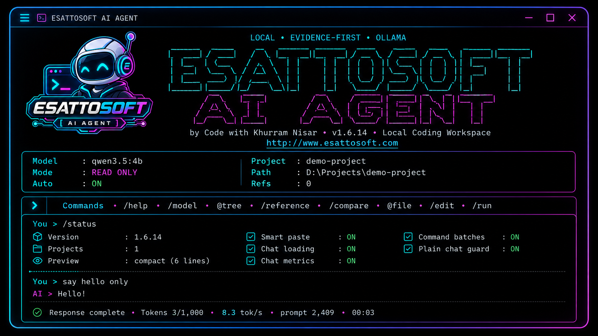

<p align="center">
  
</p>

<h1 align="center">Esattosoft AI Agent</h1>

<p align="center">
  <strong>Local • Evidence-First • Ollama-Powered Coding Agent</strong>
</p>

<p align="center">
  A local terminal-based AI coding workspace for Windows and macOS with evidence-first analysis, safe edits, explicit approvals, sessions, project rules, model switching, and controlled terminal workflows.
</p>

<p align="center">
  <a href="https://www.esattosoft.com">Website</a> •
  <a href="https://github.com/Esattosoft/esattosoft-ai-agent-docs/releases">Releases</a>
</p>

<p align="center">
  
  
  
</p>



## Install

### Windows 10/11 x64

- Windows 10/11 x64
- Ollama
- At least one Ollama model

Recommended lightweight model:

```powershell
ollama pull qwen3.5:4b
```

Install Esattosoft AI Agent:

```powershell
irm https://raw.githubusercontent.com/Esattosoft/esattosoft-ai-agent-docs/main/install.ps1 | iex
```

Then start:

```powershell
esattosoft-ai
```

The installer downloads the current Windows x64 standalone ZIP, verifies the ZIP SHA256 checksum, extracts the complete compiled runtime under your user profile, and adds the standalone install directory to your user PATH when needed. Windows v1.6.17 uses the standalone package rather than Nuitka onefile because standalone Ctrl+C behavior is the verified release path.

**Current Windows release:** v1.6.17 x64

### macOS Apple Silicon

Requirements:

- macOS on Apple Silicon (`arm64`)
- Ollama
- At least one Ollama model

Recommended model:

```bash
ollama pull qwen3.5:4b
```

Install:

```bash
curl -fsSL https://raw.githubusercontent.com/Esattosoft/esattosoft-ai-agent-docs/main/install.sh | sh
```

Open a new Terminal window if the installer adds `~/.local/bin` to your PATH.

Start:

```bash
esattosoft-ai
```

The macOS installer downloads the current macOS arm64 release, verifies its SHA256 checksum, and installs it to `~/.local/bin/esattosoft-ai`.

**Current macOS release:** v1.6.16 arm64

> macOS Developer ID signing and notarization are not yet part of the current release pipeline.

### Intel Mac / Linux

Intel (`x86_64`) macOS and Linux binary releases are not currently published or formally verified.

## Highlights

- Local Ollama-powered coding workflow
- Evidence-first file analysis
- READ ONLY and WRITE modes
- Focused edits with diff preview
- Explicit approval gates
- Automatic edit backups
- Project history and project picker
- Global and project-level rules
- Session save and restore
- Read-only reference workspaces
- Smart large-paste collapsing
- Command-batch paste support
- Live token/timing metrics
- Ollama model selection and previous-model unload
- `/run` terminal command routing
- Ctrl+C / Esc cancellation
- Persistent terminal scrollback

## First Run

Useful commands:

```text
/status
/project <path>
/project list
/model
/models
/mode read
/mode write
/auto on
/auto off
/rules
/session restore last
/run ollama ps
```

## Releases

Windows and macOS binaries are published on the Releases page:

https://github.com/Esattosoft/esattosoft-ai-agent-docs/releases

Current release metadata is published in:

```text
latest.json
```

Each installer download is verified against the SHA256 value in the release metadata.

## Source Code

The Esattosoft AI Agent application source is maintained in a private development repository.

This public repository contains documentation, Windows and macOS installers, release metadata, public assets, and compiled release downloads.

## Privacy

Esattosoft AI Agent is designed to work with local Ollama models. Project analysis and model inference are performed through the user's local Ollama installation.

Always review diffs and terminal commands before approving write or execution actions.

## Support

Website: https://www.esattosoft.com  
GitHub: https://github.com/Esattosoft  
Public contact: knisar6464@gmail.com

## Copyright

Copyright © 2026 Esattosoft. All rights reserved.
